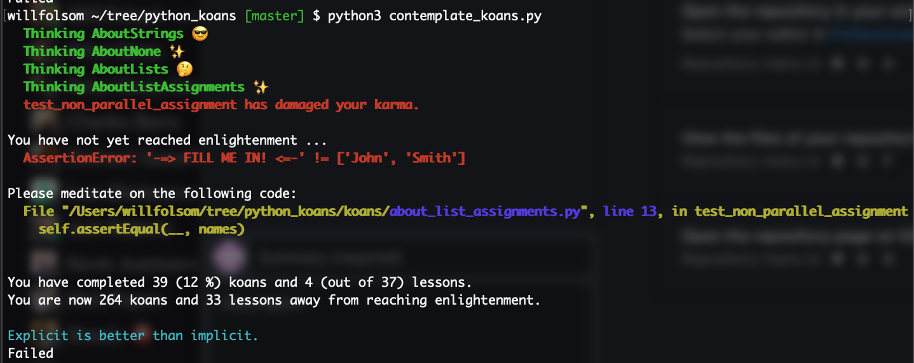
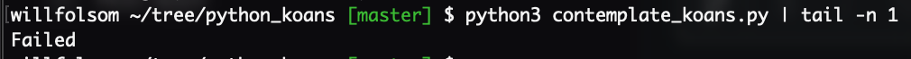

# Python Koans


Custom fork of Python Koans. Added emoji and some random command line stuff. If a batch of tests pass, it'll show up in green with a random emoji. If one is started, it'll show the first failing test in red.

Example output:



The last line of the output shows the overall status without the fluff. To see just this output and how you're doing (think of it as "hard mode"), run:

```python3 contemplate_koans.py | tail -n 1```



The action uses this command.

For anything else, see the original repo.
